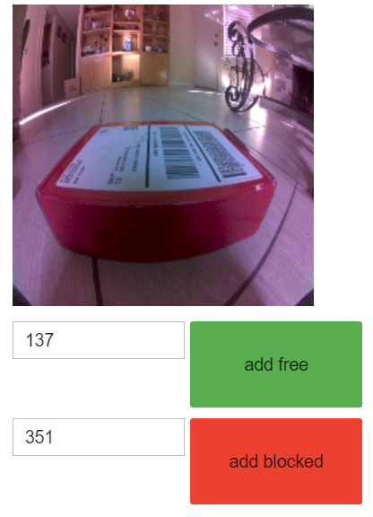
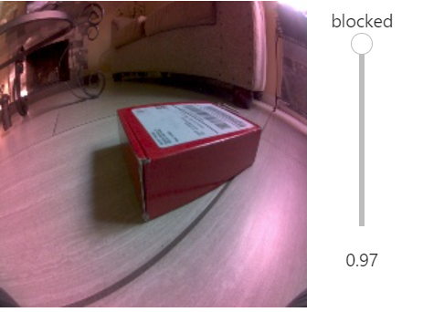

# OverView

This project was part of my undergrad Capstone Project at CSUCI. The goal of the robot was to implement machine learning to detect and avoid obstacles and to utilize  encoders to precisely get the distance the robot has travel to use for go to goal functionality. The robot is an easy to assemble SparkFun JetBot AI Kit v2.1. It uses a Jetson Nano to process the images on the camera to detect object and nativate around them. It uses an Arduino Uno to receive the ticks from the encoders to compute the distance the robot has traveled.  

## Experience Gained 
* Python 
* Arduino C++ 
* Microntrollers 

1. Interrupts 
2. Digital Inputs and Outputs 
* Jetson Nano
1. I2C Bus
2. Serial Communication between Arduino and Jetson Nano
3. Linux 
4. JupiderHub 

## Program and Code requisites 
* Python 3 
* Arduno IDE 
* jetbot library (to access motors and camera)
* IPython and ipywidgets to display screens
* PyTorch by importing torch and torchvision (used to train the machine learning model)

## HardWare Requisites
* SparkFun JetBot AI Kit V2.0(Contains Jetson Nano but no wheel encoders)
* 2 Wheel SparkFun Encoders 
* Arduino Uno 
* 6 male to male wire jumper cables for Arduino 
* USB Data Sync Cable for Arduino Uno

## Getting Started
* Install Python 3 in Jetson Nano
* Install Arduino IDE in Jetson Nano or another computer 
* Set up JupyterHub account 
* [Github page for Jetbot examples](https://github.com/NVIDIA-AI-IOT/jetbot/wiki/examples)
## Assembly
[Link to Assembly Guide for Jetbot](https://learn.sparkfun.com/tutorials/assembly-guide-for-sparkfun-jetbot-ai-kit-v20?_ga=2.261292105.536387234.1606373246-1000841287.1602133051)

## Code
* Arduino (C++)
`encoder_program.ino` is the program that reads the ticks from the encoders and displays them in the serial monitor. In the Jetson Nano side use JypyterHub and use `testing_read_serial.ipynb` to printout the data from Arduino into Jetson.This output will be received through serial communication to Jetson Nano as bytes and the Jetson Nano will process the data and determine the distance the robot has traveled.

* Python 
Use `collecting_obj_data.ipynb` to create a GUI that will be used to collect the images and associate the images having a free or blocked path.
GUI to collect data to train the machine learning algorithm to distigish a blocked from a free path: 

After collecting the data use `train_robot.ipynb` to load the images from the dataset and traint the robot. 

Once it is trained use the file `obstacle_avoidance.ipynb` to run the robot. At this point the the program will display a GUI of what the camera views and it will display if it has a free or blocked path. Once it detert a blocked path it will manueuver around the object. 

UI to display what robot views while it is running. The scroll UI on right side of image indicates if it detects an object the values increases and the avoidance function executes:

